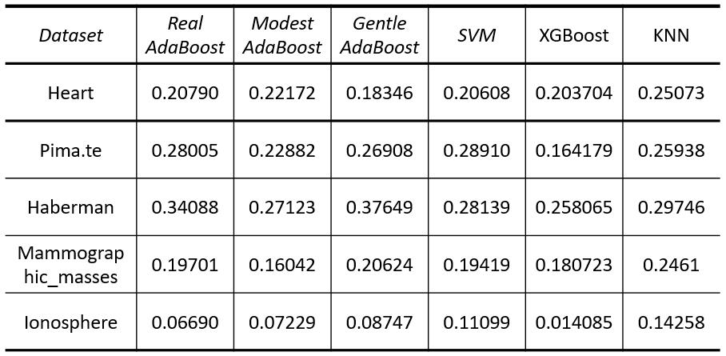

# Adaboost
Boosting is a class of machine learning methods based on the idea that a combination of simple classifiers (obtained by a weak learner) can perform better than any of the simple classifiers alone.

